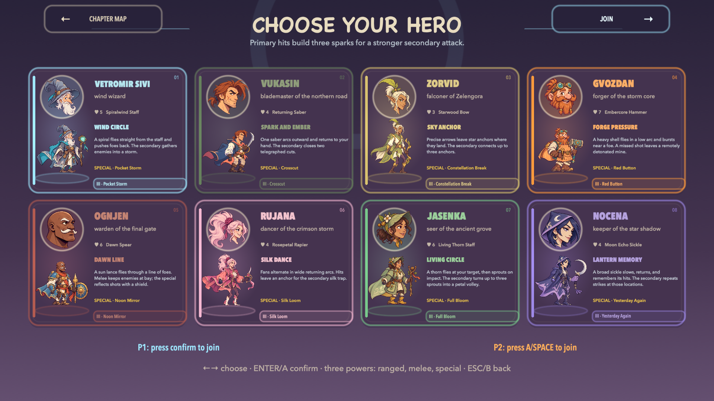

<h1 align="center">VETROMIR: SHADOWLANDS ADVENTURES</h1>

<strong>Fiercer Encounters · 7.25 · Free for Mac</strong> Eight heroes. Three core powers each. Eleven dangerous bosses.

  <a href="https://github.com/srdjankotarlic/vetromir-sivi-source/releases/tag/v7.25"><strong>DOWNLOAD FOR MAC</strong></a> ·
  <a href="https://srdjankotarlic.github.io/vetromir-sivi/en/">Website</a> ·
  <a href="INSTALL.md">Srpsko uputstvo</a> ·
  <a href="https://github.com/srdjankotarlic/vetromir-sivi-source/issues">Report a bug</a>

## Play Free

**Apple Silicon Mac (M1 or newer), macOS 13 or newer.** One app includes English
and Serbian, selectable in the main menu. No account, ads or in-game purchases.

| Installer | Download |
| --- | --- |
| **DMG: recommended** | [Download Vetromir 7.25](https://github.com/srdjankotarlic/vetromir-sivi-source/releases/download/v7.25/Vetromir-7.25-macOS-Apple-Silicon-Serbian-English.dmg) |
| ZIP alternative | [Download the app archive](https://github.com/srdjankotarlic/vetromir-sivi-source/releases/download/v7.25/Vetromir-7.25-macOS-Apple-Silicon-Serbian-English.zip) |
| File integrity | [SHA-256 checksums](https://github.com/srdjankotarlic/vetromir-sivi-source/releases/download/v7.25/SHA256SUMS-v7.25.txt) |

Open the DMG and drag **Vetromir.app** to **Applications**. This build is ad-hoc
signed, **not Apple-notarized**. If macOS blocks the first launch, use
**System Settings > Privacy & Security > Open Anyway** after attempting to open it.
See [installation help](INSTALL-EN.md). Do not disable system-wide security.

This release is for Mac, not Intel Mac, Windows, Android, iPhone or iPad.
Older iPhone releases remain historical and do not contain the 7.25 changes.

## New In 7.25

- 918 powerful ordinary enemies, distributed across ten chapters. This is 30%
  more than the local 7.24 build, rounded up per chapter, not 30% over public 7.21.
- Boss health increased by 25%, faster closing movement and shorter combo recovery.
  Nedah has five phases and 15,751 base HP, the combined health of the first ten.
- Three permanent powers per hero: ranged, melee and special. Slot four is loot.
- Painted enemy redesigns, clearer weapons and more responsive attack combinations
  from the previously local 7.22-7.24 improvements.
- Prepared boss afterimages and initial minions remove work from the first charge
  and summon. Hidden fallback models no longer animate behind the painted cast.

## A Different Arsenal For Every Hero

| Hero | Primary weapon | Follow-up or special |
| --- | --- | --- |
| **Vetromir** | Spiralwind Staff: a directed wind spiral | Pocket Storm gathers enemies into a vortex |
| **Vukasin** | One returning curved sabre | Closing Cut winds up, then crosses the target |
| **Zorvid** | Star bow: arrows plant anchors on arrival | Constellation Break connects and consumes the anchors |
| **Gvozdan** | Embercore Hammer: a low arcing shot leaves a mine | Red Button detonates placed mines |
| **Ognjen** | Dawn Spear: a true ranged lance | Noon Mirror reflects enemy projectiles |
| **Rujana** | Rosepetal Rapier: alternating returning fans | Silk Loom holds a pulsing wire trap |
| **Jasenka** | Living Thorn Staff: shots plant sentinels | Full Bloom turns the garden into petal volleys |
| **Nocena** | A returning moon sickle records impacts | Yesterday Again repeats strikes at remembered locations |

Ranged, melee and special are the three permanent skill slots. O/R3 and the old
SUPER binding activate the same special; they are not extra independent powers.
A full meter automatically boosts the next special. Match your timing to your hero.

### Find Attacks During A Run

Defeated enemies drop **Comet Comb**, **Clock Marble**, **Mirror Box** and
**Thunder Die**. Loot temporarily replaces the fourth skill slot with two or
three charges. When empty, the fourth slot clears. New loot replaces old
loot; death removes it. Saved equipment is never overwritten.

The first drop arrives after two ordinary enemy defeats, then every four more.
Summoned boss minions do not drop these attacks. The HUD shows charges and the
correct key for your control bindings. See [the arsenal guide](ARSENAL.md).

## The Adventure

The wind has vanished from Mrakovina. Cross ten chapters of forests, sky islands,
frozen climbs, buried cities and storm gates. Defeat the ten guardians to unlock
the Zero Sky, face **NEDAH** and reach the final epilogue.

- Solo or two-player local co-op.
- Eight heroes, ten chapters and an eleventh final encounter.
- Sixteen enemy types, eleven bosses, hidden runes and collectable relics.
- Variable-height jumps, wall movement, dashes and remappable controls.
- Local scores, progression and language preferences; no telemetry.
- Original AI-assisted cartoon artwork with articulated character and face animation.

## Controls And Support

Use **Settings** to inspect or change keyboard, mouse and controller bindings.
The HUD displays the currently assigned skill buttons. **Escape** pauses the game.
Switch language from the main menu; both languages share the same local progress.

[Install in English](INSTALL-EN.md) · [Instalacija na srpskom](INSTALL.md) ·
[What's new](RELEASE_NOTES.md) · [Tested scope and limitations](QA-v7.25.md) ·
[Credits](CREDITS.md) · [Asset licences](ASSET_LICENSES.md) · [Privacy](PRIVACY.md)

[Download the current press kit](https://github.com/srdjankotarlic/vetromir-sivi-source/releases/download/v7.25/Vetromir-7.25-Press-Kit.zip):
Full HD captures, release facts and English/Serbian social copy.
Old videos have been withdrawn; this pack contains no new trailer.
[Current media status](MEDIA_STATUS.md).

**Srpski:** Igra je besplatna. Preuzmi DMG iz tabele, prevuci aplikaciju u
Applications i izaberi srpski u glavnom meniju. Izdanje 7.25 donosi 918 snažnih
protivnika, opasnije bossove, tri stalne moći po junaku i poseban slot za plen.

This is the official distribution repository. Despite the historical `-source`
name, its main branch contains release information and media, not the current
development checkout. GitHub's automatic **Source code** ZIP is not the installer.
Use the DMG or application ZIP above.

Copyright © 2026 Srđan Kotarlić. Free to download and play; not an open-source
licence. Game assets and music are not a standalone reusable asset pack.
[Licence](LICENSE.md).
