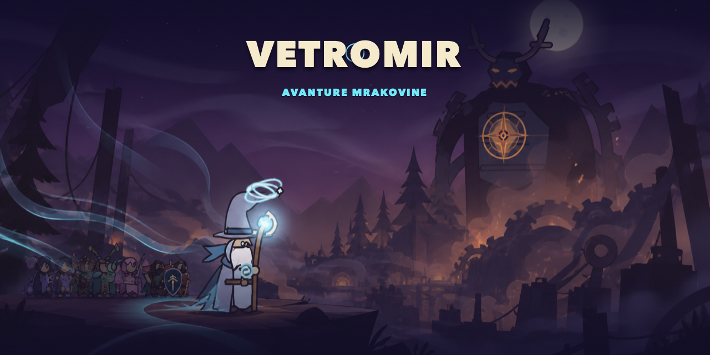
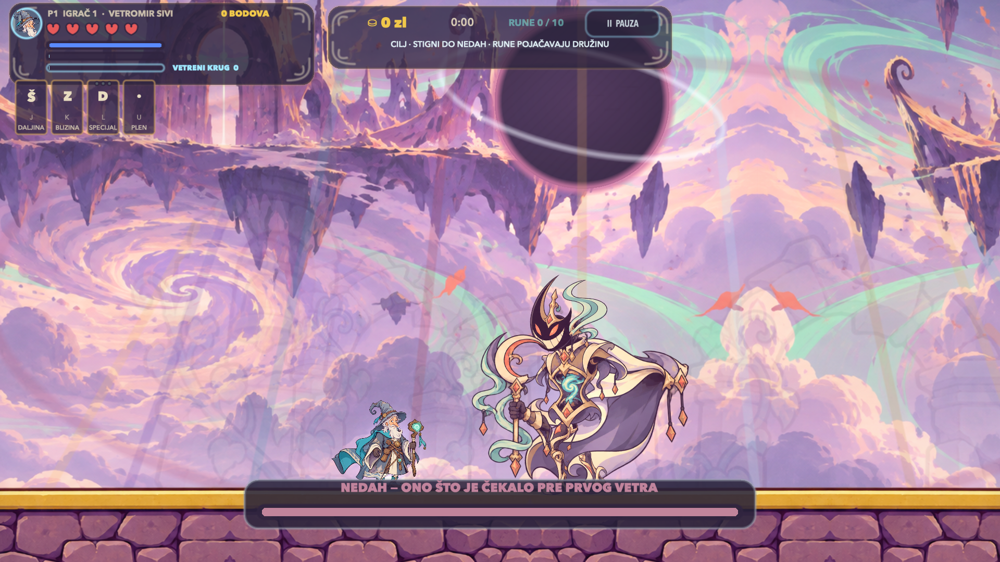
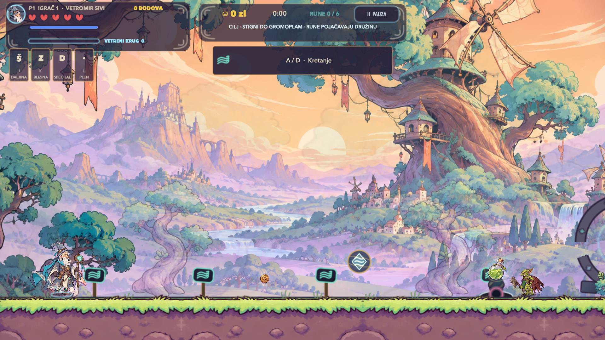
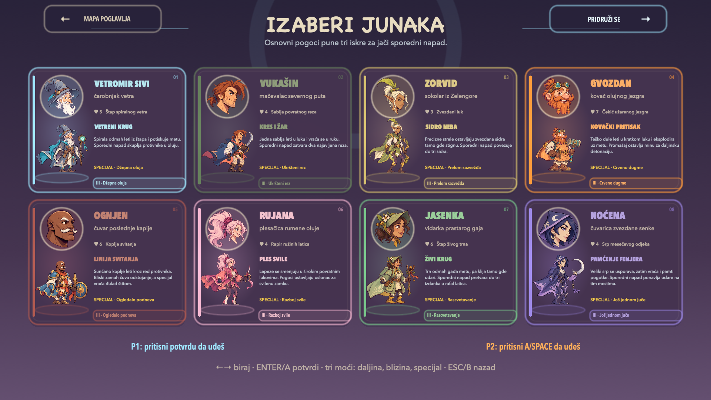
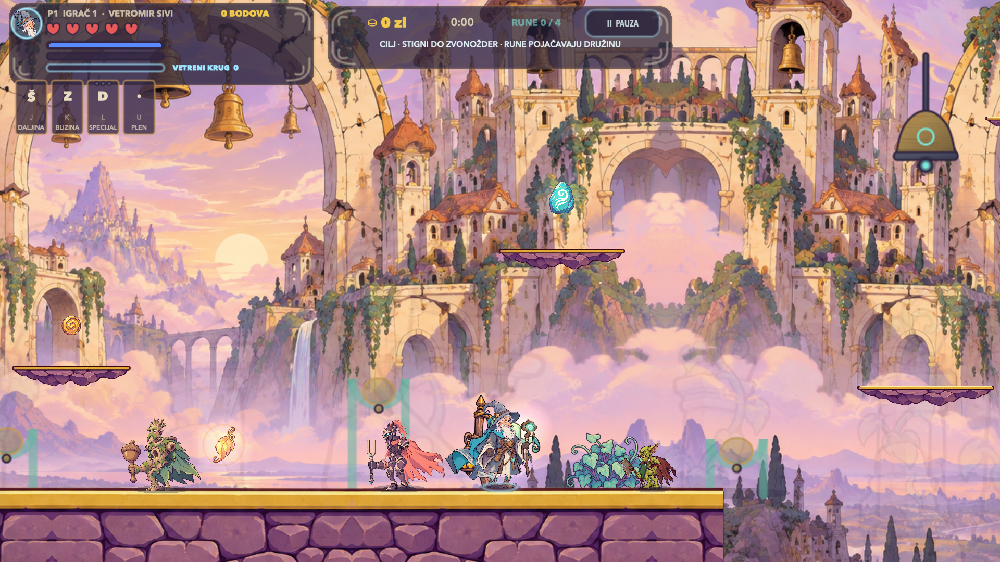
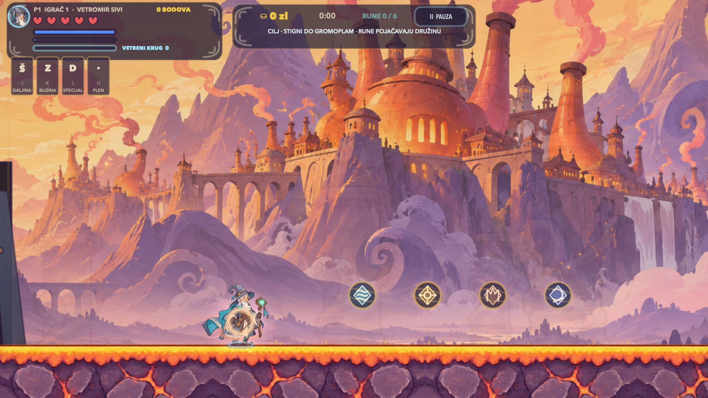
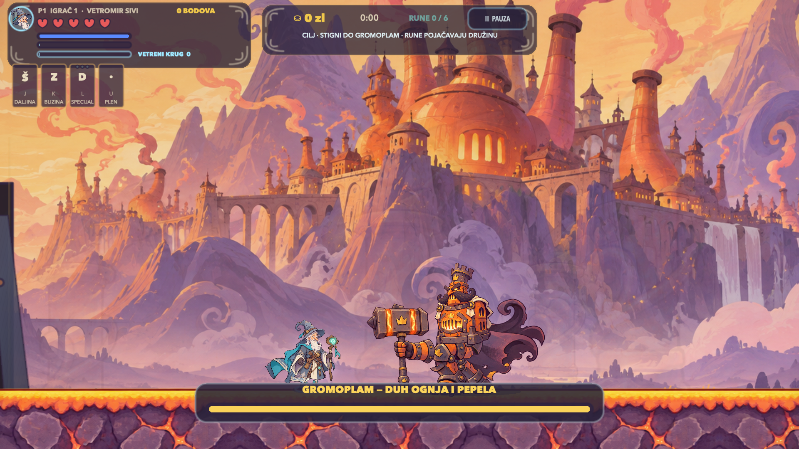
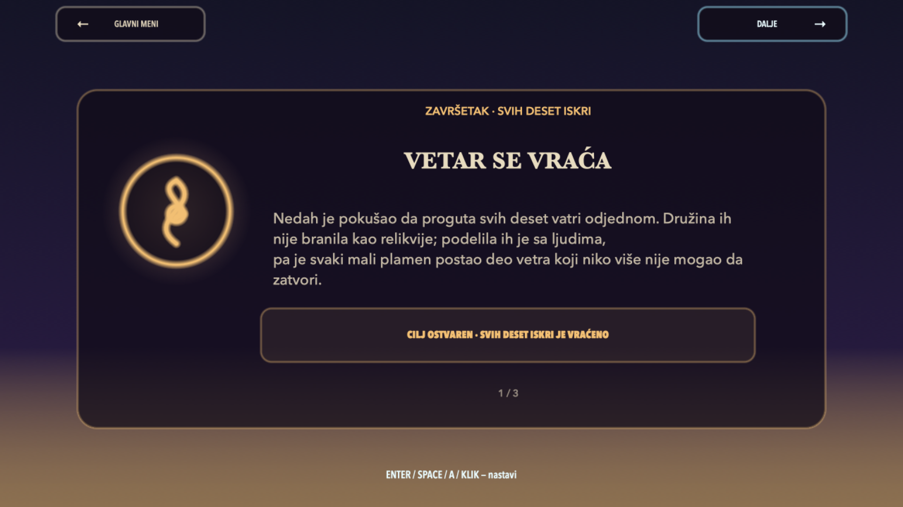

  

<h1 align="center">VETROMIR: AVANTURE MRAKOVINE</h1>

  <strong>Kad vetar utihne, avantura tek počinje.</strong> 
  Besplatna nativna 2D akciona platforma za Apple Silicon Mac, za 1–2 lokalna igrača.

  
  
  
  

  <a href="https://srdjankotarlic.itch.io/vetromir-sivi"><strong>PREUZMI BESPLATNO NA ITCH.IO</strong></a>
  &nbsp;·&nbsp;
  <a href="https://github.com/srdjankotarlic/vetromir-sivi/releases/latest"><strong>GITHUB RELEASE</strong></a>
  &nbsp;·&nbsp;
  <a href="https://github.com/srdjankotarlic/vetromir-sivi/releases/download/v7.5/Vetromir-Official-Gameplay-Trailer-1920x1080.mp4"><strong>GAMEPLAY TREJLER</strong></a>

---

Vetar je utihnuo, a deset delova Mrakovine ostalo je pod vlašću čuvara. Vetromir
Sivi i sedmoro junaka družine kreću kroz šume, nebeska ostrva, zaleđene uspone,
korenske dvorane, gradove bez odjeka i olujne kapije. Pobeda nad desetim čuvarom
tek otvara **Nulto nebo**, gde čeka konačni protivnik: **NEDAH**.

## Pogledaj Igru

  

<strong>Klikni kadar za 40-sekundni Full HD gameplay trejler.</strong>

## U Brojkama

| 8 junaka | 10 avantura + finale | 11 čuvara | 1–2 igrača |
|:--:|:--:|:--:|:--:|
| Različito kretanje i oružje | Mape duge 34k–42k tačaka | NEDAH ima 5 faza | Solo ili lokalni co-op |

| 12 vrsta neprijatelja | 1.175 neprijatelja | 3 težine | 0 oglasa i kupovina |
|:--:|:--:|:--:|:--:|
| Taktike i timski napadi | Ravnomerno raspoređeni | Podesive kontrole | Sav napredak ostaje lokalno |

## Zašto Je Drugačija

- **Junak menja pravila igre.** Svaki od osam junaka ima sopstvenu brzinu,
  skok, odbranu, resurs, glavno oružje, kombinacije, super i lični potez.
- **Pokret ima težinu.** Promenljivi skok, coyote vreme, buffer skoka, zidno
  klizanje, zidni skok, nalet, dugi skok, kontra i vazdušni udar rade kao povezan
  sistem, a ne kao odvojeni trikovi.
- **Pohod ima početak i kraj.** Deset dugih poglavlja vodi do Nultog neba, pet
  faza konačnog čuvara i završnog epiloga.
- **Borbe nisu samo pucanje.** Neprijatelji blokiraju, vrebaju, štite saborce,
  vezuju junaka, napadaju u čoporima i koriste teren.
- **Igra raste sa tobom.** Oprema, veštine, skrivene rune, privremene terenske
  moći, tri težine i trajna rang-lista menjaju sledeći pokušaj.
- **Nativna je.** Swift + SpriteKit, bez SPM zavisnosti, naloga, telemetrije,
  oglasa ili kupovina u igri.

## Osam Junaka

Vetromir kontroliše prostor vetrom i lebdenjem. Vukašin gradi ritam bliskom
borbom. Zorvid postavlja precizne sidrene hice. Gvozdan trpi udarce i menja tok
borbe kovačkim oružjem. Ognjen, Rujana, Jasenka i Noćena imaju zasebne resurse,
odbrane, kretanje i arsenale. Nijedan izbor nije samo drugačiji kostim.

## Galerija

<table>
  <tr>
    <td></td>
    <td></td>
  </tr>
  <tr>
    <td></td>
    <td></td>
  </tr>
  <tr>
    <td></td>
    <td></td>
  </tr>
</table>

## Brzi Početak

1. Otvori [najnoviji GitHub Release](https://github.com/srdjankotarlic/vetromir-sivi/releases/latest).
2. Preuzmi `Vetromir-Sivi-7.5-macOS-Apple-Silicon.dmg`.
3. Otvori DMG i prevuci `Vetromir.app` u `Applications`.
4. Prvi put pokreni aplikaciju desnim klikom pa izaberi `Open`.
5. Ako je macOS blokira, idi na `System Settings > Privacy & Security > Open Anyway`.

Izdanje je validno ad-hoc potpisano, ali nije Apple notarizovano. Detaljno
uputstvo i ZIP alternativa nalaze se u [INSTALL.md](INSTALL.md).

## Podrazumevane Kontrole

Sve kontrole mogu da se promene u meniju.

| Radnja | Tastatura i miš | Kontroler |
|---|---|---|
| Kretanje | `A / D` | leva palica / krst |
| Skok / pariranje | `SPACE` | `A` |
| Nalet | `SHIFT` | `B` |
| Napadi | `J / K / L / U` ili miš | `X / Y / R1 / L1` |
| Lični potez | `O` | `R3` |
| Super | `I` ili srednji klik | `R2` |
| Kontra | `C` | `L2` |
| Radnja / pauza | `E / P` | odgovarajuće dugme / `MENU` |

## Sistemski Zahtevi

- macOS 13 Ventura ili noviji
- Apple Silicon M1, M2, M3, M4 ili noviji
- tastatura i miš ili kompatibilan kontroler
- približno 50 MB slobodnog prostora

Intel Mac, Windows, Linux, iPhone i Android nisu podržani.

## Preuzimanja I Mediji

- [Besplatna itch.io stranica](https://srdjankotarlic.itch.io/vetromir-sivi)
- [Najnoviji DMG, ZIP i checksumovi](https://github.com/srdjankotarlic/vetromir-sivi/releases/latest)
- [Official Gameplay Trailer](https://github.com/srdjankotarlic/vetromir-sivi/releases/download/v7.5/Vetromir-Official-Gameplay-Trailer-1920x1080.mp4)
- [Kompletan promo paket v7.5](https://github.com/srdjankotarlic/vetromir-sivi/releases/download/v7.5/Vetromir-Promo-Pack-v7.5.zip)
- [Press kit](media/Vetromir-Avanture-Mrakovine-Press-Kit-v7.5.zip)

## Dokumentacija

- [Instalacija](INSTALL.md)
- [Beleške izdanja](RELEASE_NOTES.md)
- [Srpski press kit](press-kit/PRESS_KIT_SR.md)
- [English press kit](press-kit/PRESS_KIT_EN.md)
- [Licence korišćenih asseta](ASSET_LICENSES.md)
- [Autori i zasluge](CREDITS.md)
- [Privatnost](PRIVACY.md)
- [Bezbednost](SECURITY.md)

## English

**VETROMIR: ADVENTURES OF MRAKOVINA** is a free native 2D action platformer for
Apple Silicon Mac, for one or two local players. Choose from eight mechanically
distinct heroes, cross ten full chapters, unlock the Zero Sky, and face NEDAH,
a five-phase final boss with as much health as the first ten guardians combined.

The interface and story are currently in Serbian. English store copy and full
details are available in [press-kit/STORE_COPY.md](press-kit/STORE_COPY.md).

## Privatnost I Licenca

Igra ne prikuplja podatke; profil, oprema i rezultati ostaju na lokalnom Macu.
Za greške i predloge koristi [GitHub Issues](https://github.com/srdjankotarlic/vetromir-sivi/issues).

Copyright © 2026 Srđan Kotarlić. Sva prava zadržana. Igra je besplatna za
preuzimanje i lično igranje. Ovaj repozitorijum je javni distributivni centar;
izvorni kod nije javno objavljen. Nije dozvoljena prodaja, prepakivanje ili
korišćenje likova, priče i vizuelnog identiteta u drugom proizvodu. Pogledaj
[LICENSE.md](LICENSE.md), [CREDITS.md](CREDITS.md) i [ASSET_LICENSES.md](ASSET_LICENSES.md).
