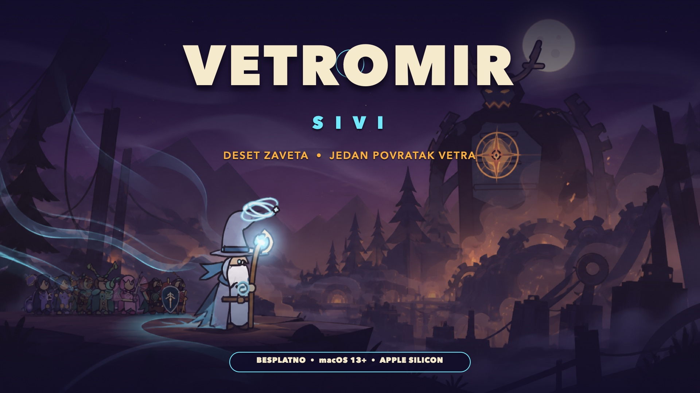
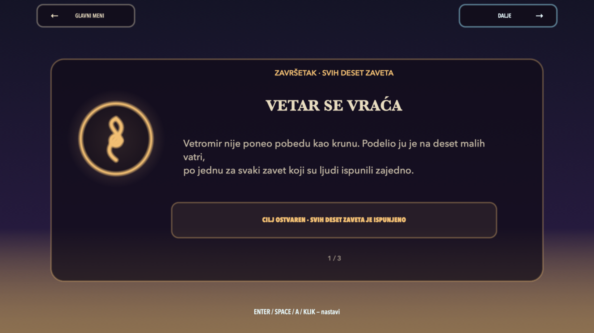

# VETROMIR SIVI

**Deset zaveta. Jedan povratak vetra.**

Besplatna nativna 2D akciona platforma za Apple Silicon Mac, za jednog ili dva
lokalna igrača. Izaberi jednog od osam mehanički različitih junaka, pređi deset
svetova i savladaj deset čuvara da bi Mrakovini vratio dah, hrabrost i sećanje.

[**Preuzmi najnoviju verziju besplatno**](https://github.com/srdjankotarlic/vetromir-sivi/releases/latest)

[Pogledaj launch trejler](media/Vetromir-Sivi-Launch-Trailer.mp4)

## Šta dobijaš

- deset završivih poglavlja i završni epilog
- osam junaka sa sopstvenim kretanjem, oružjem, resursom, superom i ličnim potezom
- deset različitih čuvara i devet porodica neprijatelja
- promenljivi skok, zidni skok, klizanje, dugi skok, nalet, kontra i vazdušni udar
- lokalni co-op za dva igrača
- tri težine, oprema, veštine, terenske moći, skrivene rune i trajna rang-lista
- bez naloga, oglasa, telemetrije i kupovina u igri
- potpuno besplatno

## Zahtevi

- macOS 13 Ventura ili noviji
- Apple Silicon M1, M2, M3, M4 ili noviji
- tastatura i miš ili kompatibilan kontroler
- približno 50 MB slobodnog prostora

Intel Mac, Windows, Linux, iPhone i Android nisu podržani.

## Instalacija

1. Otvori najnoviji [GitHub Release](https://github.com/srdjankotarlic/vetromir-sivi/releases/latest).
2. Preuzmi DMG i prevuci `Vetromir.app` u `Applications`.
3. Prvi put pokreni aplikaciju desnim klikom pa `Open`.
4. Ako je macOS blokira, otvori `System Settings > Privacy & Security` i izaberi
   `Open Anyway`.

Izdanje je validno ad-hoc potpisano, ali još nije Apple notarizovano, zato se pri
prvom pokretanju može pojaviti Gatekeeper upozorenje. Detalji su u [INSTALL.md](INSTALL.md).

## Galerija

## English

VETROMIR SIVI is a free native 2D action platformer for Apple Silicon Mac, for one
or two local players. Choose from eight mechanically distinct heroes, cross ten
worlds, and defeat ten guardians in a complete journey with a clear ending.

The interface and story are currently in Serbian. See the English store and press
description in [press-kit/STORE_COPY.md](press-kit/STORE_COPY.md).

## Privatnost i podrška

Igra ne prikuplja podatke i sav napredak čuva lokalno. Pogledaj [PRIVACY.md](PRIVACY.md).
Za greške i predloge koristi [GitHub Issues](https://github.com/srdjankotarlic/vetromir-sivi/issues).

## Autorsko pravo

Copyright © 2026 Srđan Kotarlić. Sva prava zadržana.

Igra je besplatna za preuzimanje i lično igranje. Izvorni kod nije javno objavljen,
a besplatno izdanje ne daje dozvolu za prodaju, prepakivanje ili korišćenje likova,
priče i vizuelnog identiteta u drugom proizvodu. Pogledaj [LICENSE.md](LICENSE.md),
[CREDITS.md](CREDITS.md) i [ASSET_LICENSES.md](ASSET_LICENSES.md).
