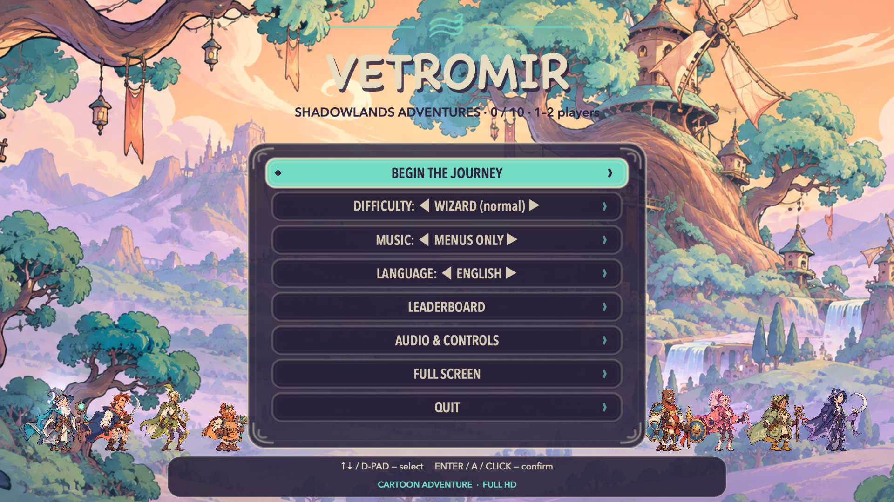
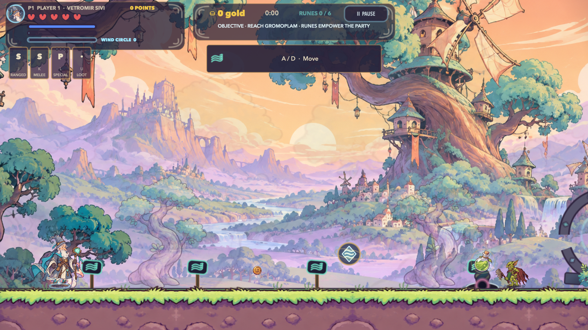
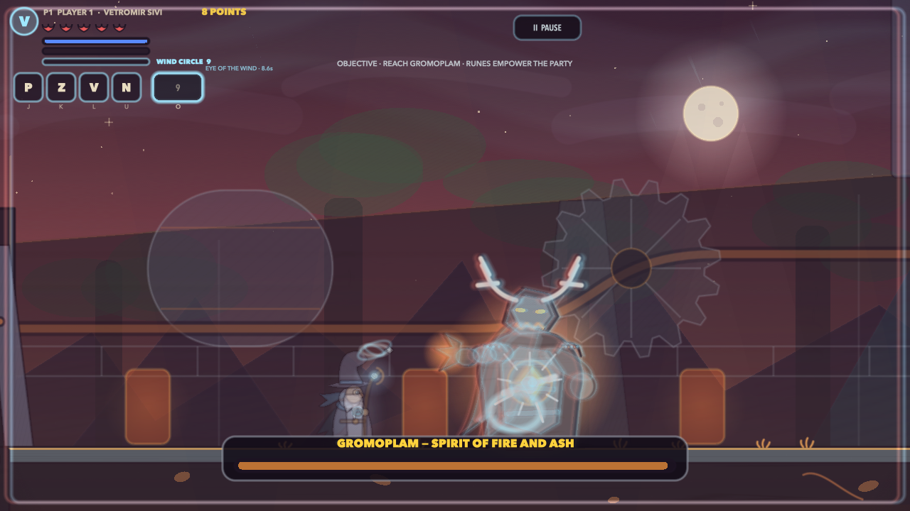
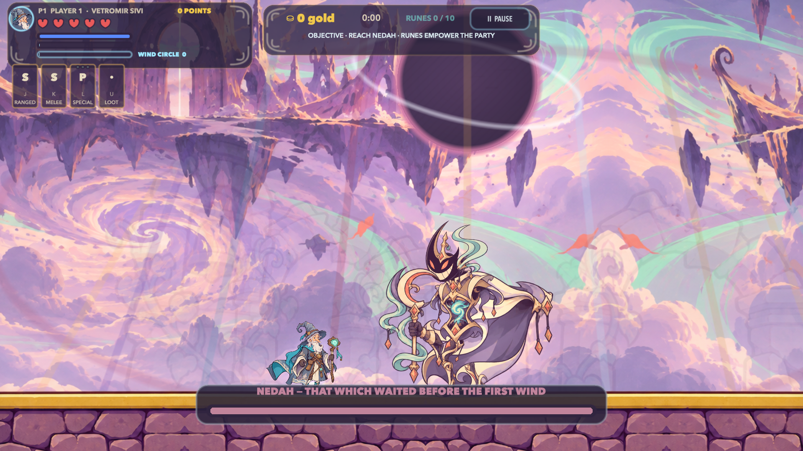

  

<h1 align="center">VETROMIR: SHADOWLANDS ADVENTURES</h1>

  <strong>When the wind falls silent, the adventure begins.</strong> 
  A free native 2D action-platformer for Apple Silicon Macs and iPhone, for 1-2 local players.

  
  
  
  
  
  
  

  <a href="https://srdjankotarlic.github.io/vetromir-sivi/en/"><strong>ENGLISH WEBSITE</strong></a>
  &nbsp;·&nbsp;
  <a href="https://srdjankotarlic.github.io/vetromir-sivi/"><strong>SRPSKA STRANICA</strong></a>
  &nbsp;·&nbsp;
  <a href="https://srdjankotarlic.itch.io/vetromir-sivi"><strong>ITCH.IO</strong></a>
  &nbsp;·&nbsp;
  <a href="https://github.com/srdjankotarlic/vetromir-sivi/releases/download/v7.5/Vetromir-Official-Gameplay-Trailer-1920x1080.mp4"><strong>GAMEPLAY TRAILER</strong></a>

---

Mrakovina has lost its wind. Ten guardians hold ten sparks across forests, sky
islands, frozen climbs, root halls, silent cities and storm gates. Choose one of
eight mechanically distinct heroes, complete every adventure, open the Zero Sky
and face **NEDAH**, a five-phase final guardian carrying the combined strength of
all ten previous bosses.

## Download

Version 7.6 includes two complete editions. Gameplay, balance, levels, audio and
visuals are identical; only the language and local save folder differ.

| Edition | Recommended | Alternative |
|---|---|---|
| **English** | [Download DMG](https://github.com/srdjankotarlic/vetromir-sivi/releases/download/v7.6/Vetromir-Shadowlands-Adventures-7.6-macOS-Apple-Silicon-English.dmg) | [Download ZIP](https://github.com/srdjankotarlic/vetromir-sivi/releases/download/v7.6/Vetromir-Shadowlands-Adventures-7.6-macOS-Apple-Silicon-English.zip) |
| **Srpski** | [Preuzmi DMG](https://github.com/srdjankotarlic/vetromir-sivi/releases/download/v7.6/Vetromir-Sivi-7.6-macOS-Apple-Silicon-Serbian.dmg) | [Preuzmi ZIP](https://github.com/srdjankotarlic/vetromir-sivi/releases/download/v7.6/Vetromir-Sivi-7.6-macOS-Apple-Silicon-Serbian.zip) |

Both apps can be installed on the same Mac. They use separate save data, so an
English playthrough never overwrites a Serbian one.

### iPhone 7.7

The iPhone edition contains both Serbian and English in one app and supports iOS 15
or later. Choose the easiest route available to you:

- **AltStore Classic:** [add the official VETROMIR source](altstore://source?url=https%3A%2F%2Fsrdjankotarlic.github.io%2Fvetromir-sivi%2Faltstore-source.json), then tap Install.
- **Direct IPA:** [download the unsigned IPA](https://github.com/srdjankotarlic/vetromir-sivi/releases/download/iphone-7.7/Vetromir-iPhone-7.7-build23-unsigned.ipa) and sign it with AltStore Classic or another local signer.
- **Official Xcode route:** [download the complete source package](https://github.com/srdjankotarlic/vetromir-sivi/releases/download/iphone-7.7/Vetromir-iPhone-7.7-Xcode-Source.zip), choose your Personal Team and press Run.

Apple does not permit an unsigned GitHub IPA to install directly from Safari. A free
Apple Account supports personal on-device installation, but the signature needs
periodic refresh. Read the bilingual [iPhone installation guide](INSTALL-IPHONE.md).

## At A Glance

| 8 heroes | 10 adventures + finale | 11 guardians | 1-2 players |
|:--:|:--:|:--:|:--:|
| Distinct movement and weapons | 34k-42k point maps | Five-phase NEDAH fight | Solo or local co-op |

| 12 enemy archetypes | 1,175 enemies | 3 difficulties | 0 ads or purchases |
|:--:|:--:|:--:|:--:|
| Tactical and coordinated attacks | Distributed across the campaign | Remappable controls | All progress stays local |

## What Makes It Different

- **Your hero changes the rules.** Every hero has unique movement tuning,
  primary weapon physics, melee geometry, defence, resource, counter, signature
  move, super and skill tree.
- **Movement is a complete system.** Variable jump height, coyote time, jump
  buffering, wall slides, wall jumps, dashes, long jumps, counters and aerial
  strikes work together.
- **The journey has a real ending.** Ten full chapters unlock the Zero Sky, a
  five-phase final battle and a complete epilogue.
- **Combat is more than shooting.** Enemies block, ambush, protect allies, bind
  heroes, coordinate attacks and use the terrain.
- **Every run can evolve.** Equipment, permanent skills, hidden runes and four
  temporary field powers change weapons, movement and defence.
- **It is native.** Swift and SpriteKit, with no accounts, telemetry, ads,
  subscriptions or in-game purchases.

## English Gameplay

<table>
  <tr>
    <td></td>
    <td></td>
  </tr>
  <tr>
    <td></td>
    <td></td>
  </tr>
  <tr>
    <td></td>
    <td></td>
  </tr>
</table>

## Eight Heroes

- **Vetromir Grey** controls space with wind rings, aerial drift, glide and vortexes.
- **Vukasin** builds close-range rhythm with chained returning blades and counters.
- **Zorvid** breaks trajectories with anchor arrows, precision and a triple jump.
- **Gvozdan** uses an arcing forge cannon, magnetic hammer, heat and armour plates.
- **Ognjen** advances behind a frontal guard with a sun spear and party support.
- **Rujana** fights with twin war fans, rose wire, marks and phase doubles.
- **Jasenka** plants sentinel seeds, roots enemies and grows healing bark.
- **Nocena** wields a chained sickle, star lantern, eclipse and life harvest.

Their power budgets are balanced, so the choice changes how you play without
creating one mandatory best hero.

## Installation

1. Download the English or Serbian DMG from the table above.
2. Open the DMG and drag the application into `Applications`.
3. On first launch, right-click the app and choose `Open`.
4. If macOS blocks it, use `System Settings > Privacy & Security > Open Anyway`.

The public build is ad-hoc signed but not Apple-notarized. Read
[INSTALL-EN.md](INSTALL-EN.md) or [INSTALL.md](INSTALL.md) for full instructions.

## Default Controls

All controls can be changed from the main menu.

| Action | Keyboard / mouse | Controller |
|---|---|---|
| Move | `A / D` | left stick / D-pad |
| Jump / parry | `SPACE` | `A` |
| Dash | `SHIFT` | `B` |
| Skill attacks | `J / K / L / U` or mouse | `X / Y / R1 / L1` |
| Signature move | `O` | `R3` |
| Super | `I` or middle mouse | `R2` |
| Counter | `C` | `L2` |
| Interact / pause | `E / P` | assigned button / `MENU` |

## Requirements

### macOS

- macOS 13 Ventura or newer
- Apple Silicon M1, M2, M3, M4 or newer
- keyboard and mouse, or a compatible controller
- approximately 100 MB of free space

### iPhone

- iOS 15 or newer
- iPhone 11 or newer recommended
- AltStore Classic or a Mac with Xcode for local signing

Intel Macs, Windows, Linux, iPad and Android are not supported game targets.

## Media And Documentation

- [English website](https://srdjankotarlic.github.io/vetromir-sivi/en/)
- [Serbian website](https://srdjankotarlic.github.io/vetromir-sivi/)
- [Free itch.io page](https://srdjankotarlic.itch.io/vetromir-sivi)
- [Latest release and checksums](https://github.com/srdjankotarlic/vetromir-sivi/releases/latest)
- [iPhone installation guide](INSTALL-IPHONE.md)
- [Official AltStore source](https://srdjankotarlic.github.io/vetromir-sivi/altstore-source.json)
- [Official gameplay trailer](https://github.com/srdjankotarlic/vetromir-sivi/releases/download/v7.5/Vetromir-Official-Gameplay-Trailer-1920x1080.mp4)
- [English press kit](press-kit/PRESS_KIT_EN.md)
- [Serbian press kit](press-kit/PRESS_KIT_SR.md)
- [Asset licences](ASSET_LICENSES.md)
- [Credits](CREDITS.md)
- [Privacy](PRIVACY.md)
- [Security](SECURITY.md)

## Privacy And Licence

The game collects no data. Profiles, equipment, scores and leaderboards remain
on the local Mac or iPhone. Bugs and feedback can be submitted through
[GitHub Issues](https://github.com/srdjankotarlic/vetromir-sivi/issues).

Copyright © 2026 Srđan Kotarlić. All rights reserved. The game is free to
download and play. This repository is the public distribution hub. The iPhone
source package is supplied only for personal building and installation under
the project licence. Resale, repackaging or reuse of the game's
characters, story, music and visual identity is not permitted. See
[LICENSE.md](LICENSE.md), [CREDITS.md](CREDITS.md) and
[ASSET_LICENSES.md](ASSET_LICENSES.md).

---

## Srpski

Kompletno srpsko izdanje ostaje dostupno i ima istu kampanju, mehaniku, balans,
muziku i grafiku kao englesko izdanje. Otvori
[srpsku stranicu](https://srdjankotarlic.github.io/vetromir-sivi/) ili preuzmi
[srpski DMG](https://github.com/srdjankotarlic/vetromir-sivi/releases/download/v7.6/Vetromir-Sivi-7.6-macOS-Apple-Silicon-Serbian.dmg).
